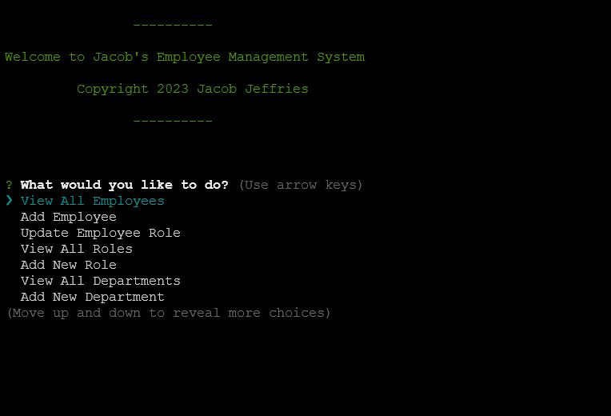

# Employee Management System - Module 12 Challenge

## Description

This small application allows a business owner to manage their staff. They can create new roles and departments in the company and then add new employees to those roles, as well as updating existing employee roles.



## Installation & Usage

1. Start by cloning the Git Repository from this GitHub repository: https://github.com/Jacob-Jeffries/m12c
2. Navigate to the working directory of this repo.
3. Initialize node packages
```
$ npm i
```
4. Make sure that your MySQL server is running, on Ubuntu:
```
sudo /etc/init.d/mysql start
```
5. Open a MySQL session using your username and password
6. Set up the database and seed the tables:
```
mysql> source ./db/schema.sql
~
mysql> source ./db/seeds.sql
```
7. Check that this worked by using the newly created database and showing tables, then exit bak to the terminal.
```
mysql> use employees_db;
~
mysql> show tables;
~
mysql> exit;
```
8. Open VS Code (or another editor) create a .env file, then add your username and password. This should be structured the same way as in the .env.Example file.
```
DB_NAME = 'employees_db'
DB_USER = ''
DB_PASS = ''
```
9. Return to the terminal and run the application from the root of its working directory.
```
$ node index.js
```
10. Follow the onscreen prompts to view Departments, Roles, and Employees; add new departments, roles, and employees; then update current employee roles. See the following video 
11. Select [QUIT] from the main menu to exit.

https://www.youtube.com/watch?v=B7U0Ed734fY

## Credits

Coded by Jacob Jeffries

### Packages Used
* Node.js v18.13.0
* npm v8.19.3
* console.table v0.10.0
* dotenv v16.0.3
* inquirer v8.2.4 (Do not try to use v9.x)
* mysql2 v3.2.0

## License

MIT License

Copyright (c) [2023] [Jacob Jeffries]

Permission is hereby granted, free of charge, to any person obtaining a copy
of this software and associated documentation files (the "Software"), to deal
in the Software without restriction, including without limitation the rights
to use, copy, modify, merge, publish, distribute, sublicense, and/or sell
copies of the Software, and to permit persons to whom the Software is
furnished to do so, subject to the following conditions:

The above copyright notice and this permission notice shall be included in all
copies or substantial portions of the Software.

THE SOFTWARE IS PROVIDED "AS IS", WITHOUT WARRANTY OF ANY KIND, EXPRESS OR
IMPLIED, INCLUDING BUT NOT LIMITED TO THE WARRANTIES OF MERCHANTABILITY,
FITNESS FOR A PARTICULAR PURPOSE AND NONINFRINGEMENT. IN NO EVENT SHALL THE
AUTHORS OR COPYRIGHT HOLDERS BE LIABLE FOR ANY CLAIM, DAMAGES OR OTHER
LIABILITY, WHETHER IN AN ACTION OF CONTRACT, TORT OR OTHERWISE, ARISING FROM,
OUT OF OR IN CONNECTION WITH THE SOFTWARE OR THE USE OR OTHER DEALINGS IN THE
SOFTWARE.